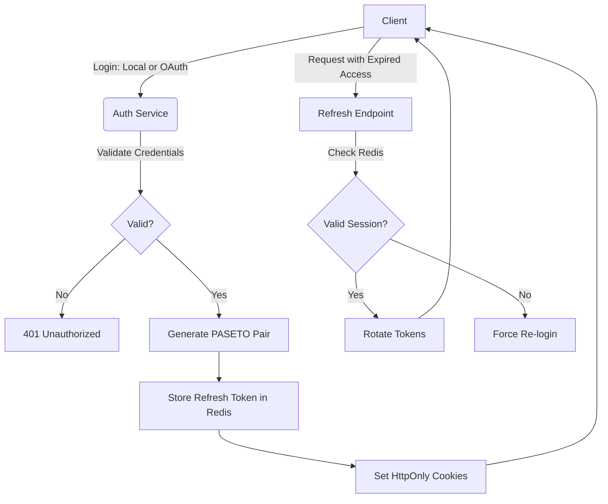

<h1>Hexum</h1>
<h3>Axum Hexagonal API</h3>
 

A scalable, production-ready **REST API** built with **Rust** and **Axum**, featuring a custom authentication system supporting **Local** (Email/Username & Password) and **OAuth2** (Google & GitHub) providers. This project implements **Hexagonal Architecture** to ensure core business logic remains decoupled from infrastructure concerns like PostgreSQL, Redis, and external APIs.

## Hexagonal Architecture

The project is structured to ensure that business rules are independent of external frameworks, databases, and tools.

* `domain/`: The core of the application. Contains pure business logic, entities, and Value Objects. It has zero dependencies on other layers.

* `application/`: Orchestrates the flow of data.

    * **Input Ports:** Traits that define the system's capabilities (e.g., UserUseCase, AuthUseCase).

    * **Output Ports:** Traits that define what the system requires from the outside world (e.g., UserRepository, SessionPort).

    * **Services:** Implements business use cases by using adapters that satisfy the defined ports.

* `infrastructure/`: The Adapters. Contains the concrete implementations of the Output Ports (e.g., SQLx for PostgreSQL, Redis for caching, or SMTP for emails).

* `presentation/`: The entry point for the outside world. Contains the HTTP routes, Axum handlers, request/response DTOs, and OpenAPI definitions.

## Authentication Architecture

The system uses a robust **access+refresh** token strategy with PASETO (Platform-Agnostic Security Tokens).

### Token specification
**Access Token:**
* Lifetime: 15 Minutes
* Storage: HttpOnly, Secure, SameSite=Strict Cookie.

**Refresh Token:**
* Lifetime: 7 Days
* Storage: HttpOnly, Secure, SameSite=Strict Cookie and indexed in Redis for session revocation.

## Authentication Flow

