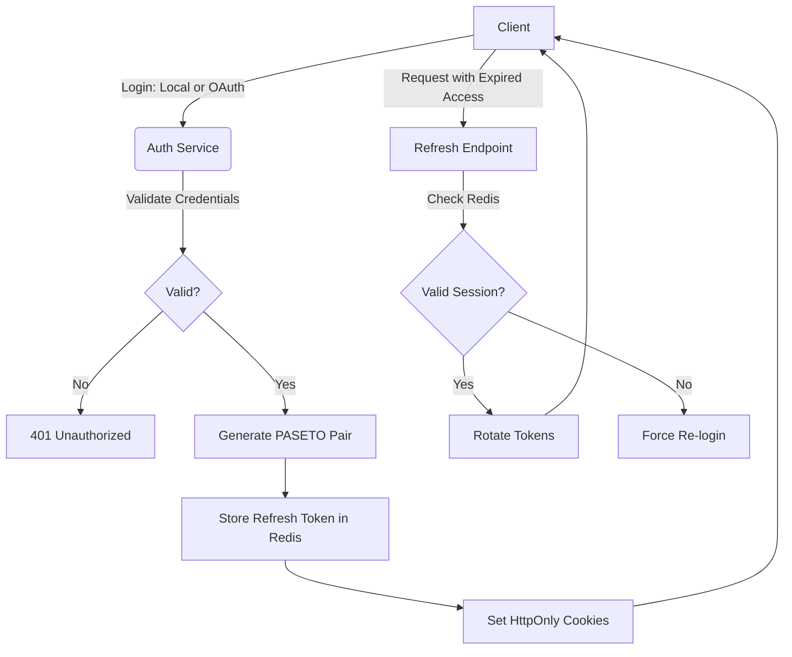

<h1>Hexum</h1>
<h3>Axum Hexagonal API</h3>
<br>

A scalable, production-ready **REST API** built with **Rust** and **Axum**, featuring a custom authentication system supporting **Local** (Email/Username & Password) and **OAuth2** (Google & GitHub) providers. This project implements **Hexagonal Architecture** to ensure core business logic remains decoupled from infrastructure concerns like PostgreSQL, Redis, and external APIs.

## Table of Contents

* [Hexagonal Architecture](#hexagonal-architecture)
* [Authentication Architecture](#authentication-architecture)
    * [Token Specification](#token-specification)
    * [Authentication Flow](#authentication-flow)
* [Local Development](#local-development)
    * [1. One-Time Local Configuration (.env & base.toml)](#1-one-time-development-configuration-env--basetoml)
    * [2. Launch the Development Stack](#2-launch-the-development-stack)
* [Deployment](#deployment)
    * [1. One-Time Production Configuration (.env & base.toml)](#1-one-time-production-configuration-env--basetoml)
    * [2. Deployment via GitHub Actions CI/CD Pipeline](#2-deployment-via-github-actions-cicd-pipeline)

## Hexagonal Architecture

The project is structured to ensure that business rules are independent of external frameworks, databases, and tools.

* `domain/`: The core of the application. Contains pure business logic, entities, and Value Objects. It has zero dependencies on other layers.

* `application/`: Orchestrates the flow of data.

    * **Input Ports:** Traits that define the system's capabilities (e.g., UserUseCase, AuthUseCase).

    * **Output Ports:** Traits that define what the system requires from the outside world (e.g., UserRepository, SessionPort).

    * **Services:** Implements business use cases by using adapters that satisfy the defined ports.

* `infrastructure/`: The Adapters. Contains the concrete implementations of the Output Ports (e.g., SQLx for PostgreSQL, Redis for caching, or SMTP for emails).

* `presentation/`: The entry point for the outside world. Contains the HTTP routes, Axum handlers, request/response DTOs, and OpenAPI definitions.

## Authentication Architecture

The system uses a robust **access+refresh** token strategy with PASETO (Platform-Agnostic Security Tokens).

### Token specification
**Access Token:**
* Lifetime: 15 Minutes
* Storage: HttpOnly, Secure, SameSite=Strict Cookie.

**Refresh Token:**
* Lifetime: 7 Days
* Storage: HttpOnly, Secure, SameSite=Strict Cookie and indexed in Redis for session revocation.

### Authentication Flow


<hr>

## Local Development

Follow these steps to set up and run the application suite locally on your machine for development.

### 1. One-Time Development Configuration (.env & base.toml)
Before running the application locally, you must initialize both the local environment variables and the development configuration settings in your project root:

1. **Create the local environment file:** Create a file named `.env` in the root directory of your project (where `Cargo.toml` is located) and populate it with the local service credentials:
   ```env
   DB_USER=${VALUE}
   DB_PASSWORD=${VALUE}
   DB_NAME=${VALUE}
   REDIS_PASSWORD=${VALUE}
   ```
   *(Remember to replace `${VALUE}` with your actual local database and cache configuration values.)*

2. **Create your development settings file:** Create a file at `config/development/base.toml`. Initialize this file by copying and modifying the provided template found [here](config/development/base.toml.example). This file holds the configuration parameters (such as application logging levels or local server ports) that the Rust binary reads upon boot.

### 2. Launch the Development Stack
Spin up the local databases and compile the application binary within the local environment container:
```sh
docker compose up -d --build
```
*Note: Local execution automatically merges `docker-compose.yml` and `docker-compose.override.yml`.*

## Deployment

Deployments to the production **VPS** are fully automated using **GitHub Actions**. 

### 1. One-Time Production Configuration (.env & base.toml)
Because the production credentials and server settings are strictly excluded from source control for security, you must manually log into your VPS **once** prior to deployment to initialize your environment files:

1. Open a terminal and SSH into the remote server:
   ```sh
   ssh your_user@your_vps_ip
   ```
2. Navigate to the deployment path and ensure the required production config directories exist:
   ```sh
   cd ~/hexum
   mkdir -p config/production
   ```
3. Create the production environment file:
   ```sh
   touch .env
   ```
   Populate it with your live secrets:
   ```env
   DB_USER=${VALUE}
   DB_PASSWORD=${VALUE}
   DB_NAME=${VALUE}
   REDIS_PASSWORD=${VALUE}
   ```
   *(Remember to replace `${VALUE}` with your actual production database and cache configuration values.)*

4. Create the production settings file:
   ```sh
   touch config/production/base.toml
   ```
   Populate it with the configuration parameters for the Rust binary. Use the template found [here](config/production/base.toml.example) as the template for file.

### 2. Deployment via GitHub Actions CI/CD Pipeline
Whenever code is pushed to the `main` branch, the GitHub Actions runner automatically executes the following pipeline:
* Compiles the production-ready, minimal Rust image.
* Pushes the compiled artifact to the GitHub Container Registry (GHCR).
* Securely connects to the VPS via an SSH key.
* Checks if a Traefik container is running. If not, the workflow automatically provisions the external `web-network`, navigates into `~/traefik`, and spins up the Traefik stack using its standalone compose configuration found [here](ops/traefik/docker-compose.yml) before proceeding. If Traefik is already active, this initialization step is skipped.
* Pulls down the fresh application image from GHCR and deploys it using the main [docker-compose.yml](docker-compose.yml) file via `docker compose up -d`, successfully completing the deployment.