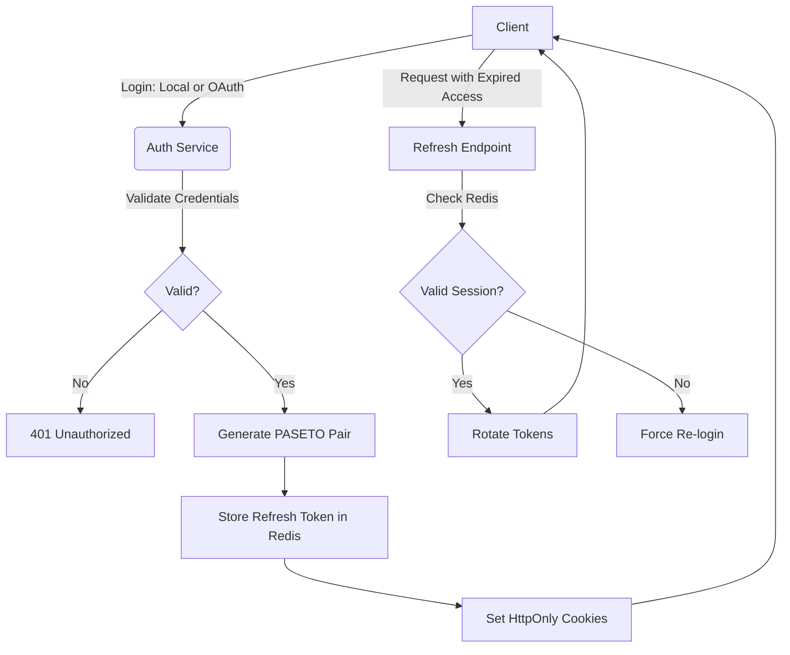

<div align="center">
  <h1>Hexum</h1>

  <h3>Axum Hexagonal API</h3>

  <!-- Rust + Axum -->
  
  <!-- Postgres -->
  
  <!-- Redis -->
  

  <br>

  <!-- Version -->
  
  <!-- CI Status -->
  
  <!-- Tests passing/failed -->
  
</div>

<br>

A scalable, production-ready **REST API** built with **Rust** and **Axum**, featuring a custom authentication system supporting **Local** (Email/Username & Password) and **OAuth2** (Google & GitHub) providers. This project implements **Hexagonal Architecture** to ensure core business logic remains decoupled from infrastructure concerns like PostgreSQL, Redis, and external APIs. The project includes a comprehensive test suite of **unit tests** (mocked dependencies) and **integration tests** (real PostgreSQL & Redis) that run automatically in CI/CD.

## Table of Contents

* [Hexagonal Architecture](#hexagonal-architecture)
* [Authentication Architecture](#authentication-architecture)
    * [Token Specification](#token-specification)
    * [Authentication Flow](#authentication-flow)
* [Local Development](#local-development)
    * [1. One-Time Local Configuration (.env & base.toml)](#1-one-time-development-configuration-env--basetoml)
    * [2. Launch the Development Stack](#2-launch-the-development-stack)
* [Testing](#testing)
    * [Run Unit Tests](#run-unit-tests)
    * [Run Integration Tests](#run-integration-tests)
* [Deployment](#deployment)
    * [1. One-Time Production Configuration (base.toml)](#1-one-time-production-configuration-basetoml)
    * [2. Deployment via GitHub Actions CI/CD Pipeline](#2-deployment-via-github-actions-cicd-pipeline)

## Hexagonal Architecture

The project is structured to ensure that business rules are independent of external frameworks, databases, and tools. Rather than using monolithic layers (e.g., `domain/`, `application/`, `infrastructure/`), the codebase is organized by **crate** and **feature**, with each layer's responsibility clearly delineated:

* [`platform/src/features/`](platform/src/features/): The **domain** and **application** layers. Pure business logic organized by domain feature (auth, user, session, security, oauth, email, verification). Each feature subdirectory contains:

    * **Port Traits** (`input.rs` / `output.rs`): Define what the application needs from the outside world (e.g., `UserRepository`, `SessionPort`) and what capabilities the system exposes (e.g., `AuthUseCase`, `UserUseCase`).
    * **Services** (`service.rs`): Implement business use cases by orchestrating the defined ports.
    * **Concrete Adapters** (e.g., `postgres.rs`, `redis.rs`, `paseto.rs`): Provide real implementations of the output port traits.

* [`platform/src/api/`](platform/src/api/): The **presentation** layer. HTTP entry point — Axum routes, handlers, request/response DTOs, error handling, OpenAPI documentation, and custom extractors.

* [`platform/src/core/`](platform/src/core/): **Infrastructure configuration**. Application config management, `PlatformState` wiring, PostgreSQL connection pooling, Redis connections, and telemetry (tracing/logging).

* [`business/`](business/): A **secondary domain** crate that follows the same hexagonal pattern — its own `api/`, `core/`, and `features/` directories — providing business-specific logic decoupled from the platform authentication concerns.

* [`api/`](api/): The **binary entry point**. Wires `platform` and `business` together, starts the HTTP server, and runs database migrations.

* [`tests/`](tests/): **Integration test suite** (`integration-tests` crate). End-to-end tests exercising the full stack against real PostgreSQL and Redis instances, with wiremock for external API mocking (e.g., Resend email service).

## Authentication Architecture

The system uses a robust **access+refresh** token strategy with PASETO (Platform-Agnostic Security Tokens).

### Token specification
**Access Token:**
* Lifetime: 15 Minutes
* Storage: HttpOnly, Secure, SameSite=Strict Cookie.

**Refresh Token:**
* Lifetime: 7 Days
* Storage: HttpOnly, Secure, SameSite=Strict Cookie and indexed in Redis for session revocation.

### Authentication Flow


<hr>

## Local Development

Follow these steps to set up and run the application suite locally on your machine for development.

### 1. One-Time Development Configuration (.env & base.toml)
Before running the application locally, you must initialize both the local environment variables and the development configuration settings in your project root:

1. **Create the local environment file:** Create a file named `.env` in the root directory of your project (where `Cargo.toml` is located) and populate it with the local service credentials and deployment metadata:
   ```env
   DB_USER=${VALUE}
   DB_PASSWORD=${VALUE}
   DB_NAME=${VALUE}
   REDIS_PASSWORD=${VALUE}
   BUSINESS_NAME=hexum
   IMAGE_TAG=hexum
   ```
   *(Remember to replace `${VALUE}` with your actual local database and cache configuration values.)*

2. **Create your development settings file:** Create a file at `config/development/base.toml`. Initialize this file by copying and modifying the provided template found [here](config/development/base.toml.example). This file holds the configuration parameters (such as application logging levels or local server ports) that the Rust binary reads upon boot.

### 2. Launch the Development Stack
Spin up the local databases and compile the application binary within the local environment container:
```sh
docker compose up -d --build
```
*Note: Local execution automatically merges `docker-compose.yml` and `docker-compose.override.yml`.*

## Testing

The project contains two tiers of tests, both of which **run automatically in CI/CD** on every push to `main` or `business-*` branches (see [`deploy.yml`](.github/workflows/deploy.yml)):

* **Unit tests** — Located in [`platform/src/tests/`](platform/src/tests/). Test individual services and use cases with mocked adapters. Fast, no external dependencies required.
* **Integration tests** — Located in [`tests/tests/`](tests/tests/). Spin up the full application stack against real PostgreSQL and Redis containers, using wiremock for external API mocking.

### Prerequisites

Ensure PostgreSQL and Redis are running (via Docker):
```sh
docker compose up -d postgres redis
```

### Run Unit Tests
```sh
cargo test -p platform --lib
```

### Run Integration Tests
```sh
cargo test -p integration-tests
```

> **Note:** Integration tests load configuration from [`config/testing/base.toml`](config/testing/base.toml) and expect `APP_ENV=testing` to be set. The test harness handles this automatically.

## Deployment

Deployments to the production **VPS** are fully automated using **GitHub Actions**. On every push to `main` or `business-*` branches, the pipeline first **runs unit and integration tests**, then builds and deploys only if all tests pass.

### 1. One-Time Production Configuration (base.toml)
Because the production credentials and server settings are strictly excluded from source control for security, you must manually log into your VPS **once** prior to deployment to initialize your configuration files:

1. Open a terminal and SSH into the remote server:
   ```sh
   ssh your_user@your_vps_ip
   ```
2. Navigate to the deployment path and ensure the required production config directories exist:
   ```sh
   cd ~/hexum
   mkdir -p config/production
   ```
3. Create the production settings file:
   ```sh
   touch config/production/base.toml
   ```
   Populate it with the configuration parameters for the Rust binary. Use the template found [here](config/production/base.toml.example) as the template for file.

> **Note:** The `.env` file on the VPS is managed automatically by the CI/CD pipeline. On each deployment, `BUSINESS_NAME` and `IMAGE_TAG` are set dynamically from the branch, and database secrets (`DB_USER`, `DB_PASSWORD`, `DB_NAME`, `REDIS_PASSWORD`) are populated with their pre-configured default values from GitHub Secrets. You only need to override these secrets manually if you require non-default values.

### 2. Deployment via GitHub Actions CI/CD Pipeline
Whenever code is pushed to the `main` branch, the GitHub Actions runner automatically executes the following pipeline:
* Runs the full test suite (unit + integration) against ephemeral PostgreSQL and Redis service containers. The pipeline halts if any test fails.
* Compiles the production-ready, minimal Rust image.
* Pushes the compiled artifact to the GitHub Container Registry (GHCR).
* Securely connects to the VPS via an SSH key.
* Checks if a Traefik container is running. If not, the workflow automatically provisions the external `web-network`, navigates into `~/traefik`, and spins up the Traefik stack using its standalone compose configuration found [here](ops/traefik/docker-compose.yml) before proceeding. If Traefik is already active, this initialization step is skipped.
* Pulls down the fresh application image from GHCR and deploys it using the main [docker-compose.yml](docker-compose.yml) file via `docker compose up -d`, successfully completing the deployment.
